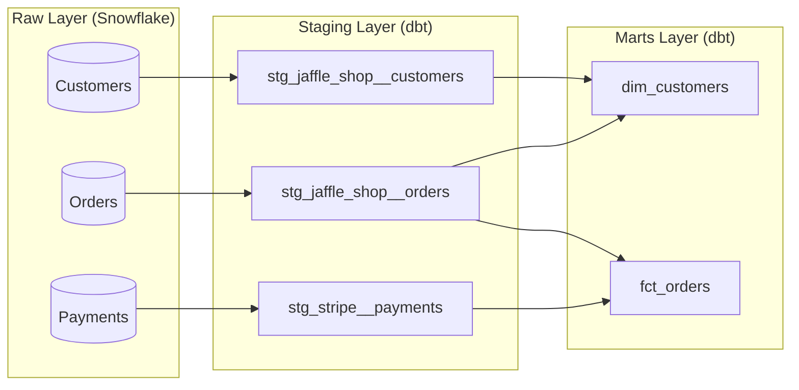

# ❄️ Snowflake + dbt: The Modern Data Stack 🚀

Welcome to the **Jaffle Shop** dbt project! This repository demonstrates a production-ready implementation of **dbt (data build tool)** integrated with **Snowflake**, showcasing best practices in data transform and modeling.

## 🏗 Architecture & DAG

This project follows the standard dbt architecture, organizing models into distinct layers to ensure scalability and maintainability.



### 📁 Modeling Layers

- **Staging (`models/staging/`)**: Clean, rename, and cast raw data. No complex logic here—just preparation.
- **Marts (`models/marts/`)**: Business-ready entities.
  - `marketing`: Customer-centric dimensions.
  - `finance`: Order and payment fact tables.

---

## 🚀 Getting Started

### 1. Prerequisites

- A **Snowflake** account (Trial works great!).
- **dbt Core** or **dbt Cloud** installed.
- Python 3.8+ if using dbt Core.

### 2. Configure Profile

Create or update your `~/.dbt/profiles.yml`:

```yaml
my_jaffle_shop:
  target: dev
  outputs:
    dev:
      type: snowflake
      account: [your_account_id]
      user: [your_username]
      password: [your_password]
      role: [your_role]
      database: [your_database]
      warehouse: [your_warehouse]
      schema: [your_schema]
      threads: 4
```

### 3. Initialize & Run

```bash
# Install dependencies (dbt_utils, etc.)
dbt deps


# Run all models
dbt run

# Run tests to ensure data quality
dbt test
```

---

## ✨ Key Features

- **Materialization Strategies**:
  - `staging` models are materialized as **views** for minimal overhead.
  - `marts` models are materialized as **tables** in Snowflake for high-performance BI queries.
- **Data Quality**: Extensive use of `unique` and `not_null` tests.
- **Documentation**: On-the-fly documentation using `dbt docs generate`.
- **Source Freshness**: Configured to alert on stale data from upstream Snowflake tables.

---

## 📊 Documentation

Generate and view the project's documentation and lineage:

```bash
dbt docs generate
dbt docs serve
```

## 🤝 Resources:

- [dbt Documentation](https://docs.getdbt.com/docs/introduction)
- [Snowflake Documentation](https://docs.snowflake.com/)
- [Jaffle Shop Website](https://www.jaffleshop.com) (Sample data source)

---
